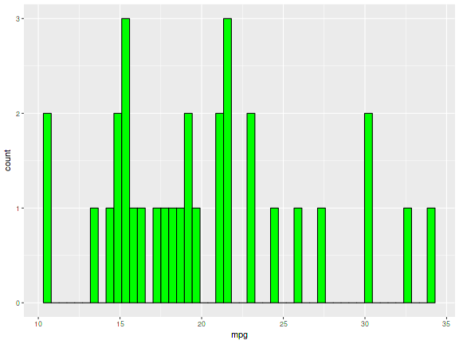
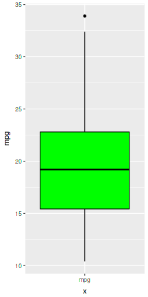

---
title       : Exploratory Machine
subtitle    : Data Product Project
author      : by Bruno Berrehuel
job         : January 29th, 2017
framework   : io2012        # {io2012, html5slides, shower, dzslides, ...}
highlighter : highlight.js  # {highlight.js, prettify, highlight}
hitheme     : tomorrow      # 
widgets     : []            # {mathjax, quiz, bootstrap}
mode        : selfcontained # {standalone, draft}
knit        : slidify::knit2slides
--- &twocol

## Hands on
The [Exploratory Machine](https://breenbo.shinyapps.io/shinyapp/) allows you to have quick overview of a dataset, with scatterplots, distributions of variables, statistical summary and samples of the datas.

### Side Panel
It is possible to select R datasest (mtcars, state.x77, iris, InsectSprays) or to choose a .csv file.
All the variables appears after loading, and they can be selected in order to be ploted and to see their distributions.

### Main Panel
The results are shown on 4 tabs :

*** =left
- Scatterplot
- Distribution

*** =right
- Summary
- Dataset Structure

--- .class #id 

## Scatterplot tab
The chosen variables are plotted in a scatterplot like the following :


```r
require(ggplot2)
ggplot(data=mtcars, aes(x=hp, y=mpg)) + geom_jitter() + xlab("hp") + ylab("mpg")
```


--- &twocol w1:75% w2:15%

## Distribution tab
The variables distribution, as histogram and boxplot, are plotted :

*** =left


*** =right


--- .class #id 

## Summary and Structure tab
Finally, the head, the tail, and the structure of the dataset are shown in table view :
- Head shows first 6 rows of datas with the head() function.
- Tail shows last 6 rows of datas with the tail() function.
- Structure is shown with the str() function.
